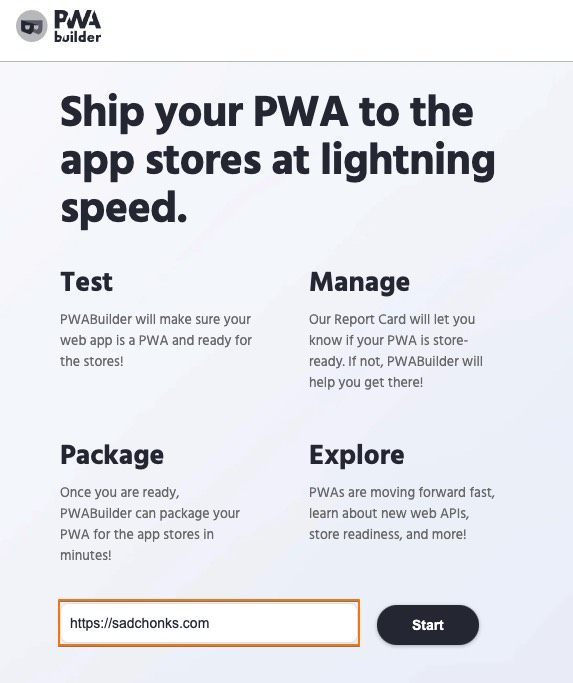
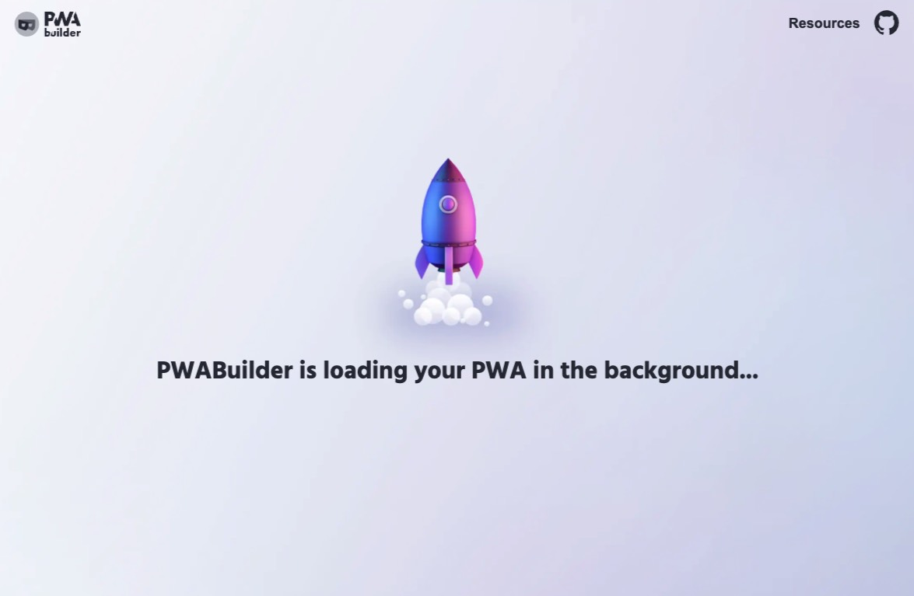
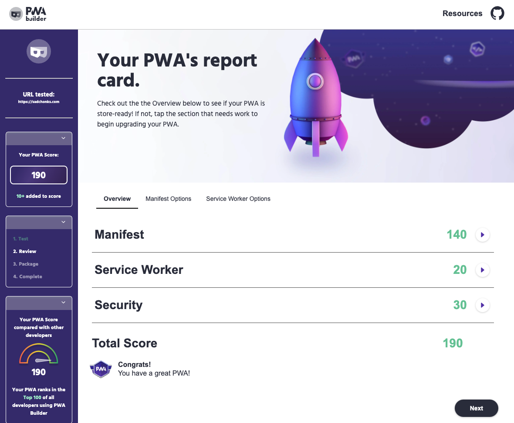
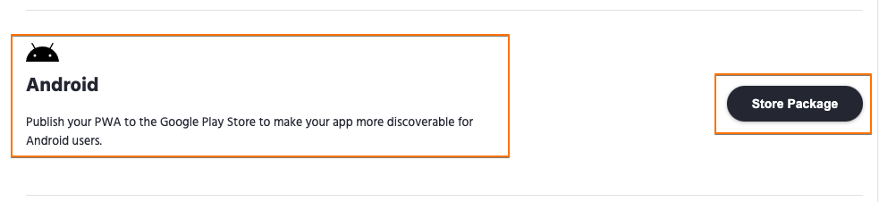
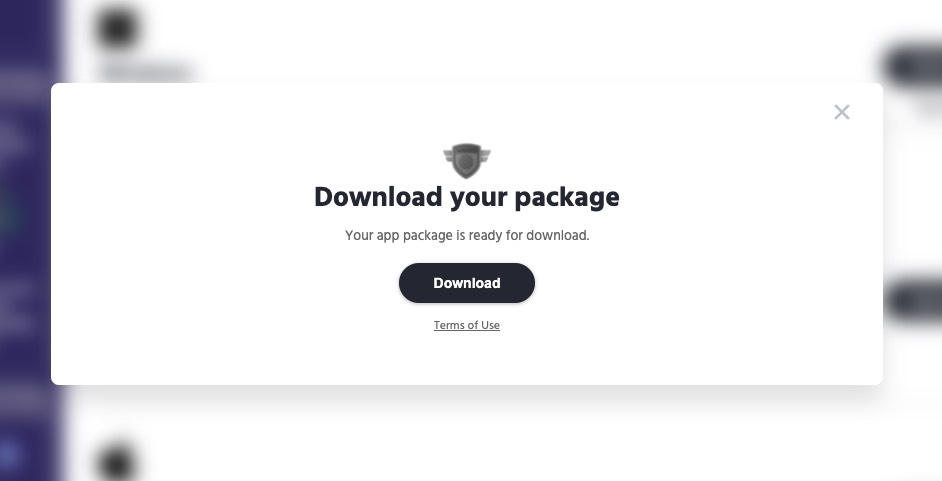

# How to Generate a PWA Android package for AppGallery

Last updated on 2/1/2022

This guide shows you how to generate your Android application with PWABuilder
First, go to [pwabuilder.com](https://pwabuilder.com) and put in the URL to your PWA, such as [https://sadchonks.com](https://sadchonks.com):

Tap start to analyze your PWA.
 

 
You are now at the report card page. If your web app is already a PWA your scores will all be green. If your score is low and not PWA-ready, please follow [PWABuilder instructions to convert your web app to a PWA](https://blog.pwabuilder.com/docs/converting-your-web-app-to-a-progressive-web-app-with-pwabuilder/). You can now tap the next button to continue to the packaging page.
 

 
You can now tap the AppGallery Package button on the AppGallery platform to generate your Android app.

In the following screen, you will see both Google Play (signed APK) and Other Android (unsigned APK) tabs. If you wish to sign your Android packages, please choose **Google Play** tab, if you wish to create an unsigned Android package, please click **Other Android** tab. There will be a list of the different options for AppGallery that are covered in more detail below. AppGallery Android package must be signed.

When you are ready, tap the Generate button to build your AppGallery app, and then the Download button when it pops up to download the generated App and associated files.

After generating your app for AppGallery, please install the package on your Huawei device to [test your application and then publish it to the Huawei AppGallery](testing-and-publishing-your-app-to-huawei-appgallery.md).
AppGallery Features & Customization
Here are the following ways you can customize your PWA package for AppGallery in **All Settings**:

* **Package ID**: The Android identifier unique to your app
* **App name**: The full name of your app. It will be automatically prepopulated with the [app name](https://w3c.github.io/manifest/#name-member) from your PWA’s app manifest.
* **Launcher name**: The name of your app in the Android launcher. This is typically the same as the app name, or a shortened version of it. It is prepopulated with [short_name](https://w3c.github.io/manifest/#short_name-member) from your PWA’s app manifest.
* **App version**: This is the version string displayed to end-users, e.g. “1.0.0.0”
* **App version code**: This is an integer used as a private, internal version of your app.
* **Host, Start URL, Manifest URL**: The URLs used to launch your PWA in the Android app. It is prepopulated for you from your app manifest.
* **Status bar color, Navbar color**: The color of the Android status bar and navigation bar in your PWA. You can also hide these bars by setting Display to Fullscreen. It is prepopulated using colors from your app manifest.
* **Navbar color**: Same as Status & Navbar colors above, but for the Android navigation bar. Also can be hidden by setting Display to Fullscreen.
* **Splash screen color**: The background color of the splash screen that will be used when creating your Android app. We prepopulate this with the theme color specified in your app manifest.
* **Splash screen fade out time**: How long to fade out the splash screen in milliseconds. It defaults to 300ms.
* **Icon URL**: URLs for the icon to use for your app. You are recommended to use a 512x512 icon.
* **Maskable icon URL**: Optional. The icon to use on Android devices shows rounded corner icons. Typically, this icon should have some padding around the icon’s content, enabling the icon to be safely rounded without losing fidelity. It is populated with a [purpose: maskable](https://w3c.github.io/manifest/#purpose-member) icon from your app manifest. If one can’t be found, we use the icon. For more information about maskable icons on Android, see [https://web.dev/maskable-icon](https://web.dev/maskable-icon).
* **Monochrome icon URL**: Optional. The monochrome icon to use for your app. Android can use this to fill your icon with a certain color based on user preferences, theme or color mode, or high contrast configurations. It is populated with a [purpose: monochrome](https://w3c.github.io/manifest/#purpose-member) icon from your app manifest.
* **Fallback behavior**: When the full TWA experience isn’t available, how should your app proceed, whether with a web view or [Android Custom Tabs feature](https://developer.chrome.com/multidevice/android/customtabs). It defaults to the latter.
* **Display mode**:
  - **Standalone** means your PWA takes up all the areas except Android status bar and Navigation bar.
  - **Fullscreen** hides both bars. This is intended for immersive experiences likes games and media playback.
* **Notifications**: If enabled, your PWA will use [Android Notification Delegation](https://github.com/GoogleChromeLabs/svgomg-twa/issues/60) for push notifications, meaning your installed PWA can send push notifications without browser permission prompts. You should enable this if your PWA sends push notifications.
* **Signing key**: How the APK app package will be digitally signed:
  - **None**: your app package won’t be signed. Unsigned packages will be signed by the Huawei AppGallery. This is Huawei’s recommendation and our default.
  - **New**: PWA Builder will create a new signing key for you. The signing key will be included in your zip download. Choosing this will let you fill in details like password, alias, and more.
  - **Mine**: Upload an existing `.keystore` file to use for signing the app package. This should be used if you are updating an existing app in the Store. You’ll be prompted to specify your existing key passwords and alias.

After you have configured All Settings, you can proceed to create a PWA package for AppGallery.

*The information on this page is sourced from [PWABuilder.com blog](https://blog.pwabuilder.com/docs/generating-your-android-package).*

