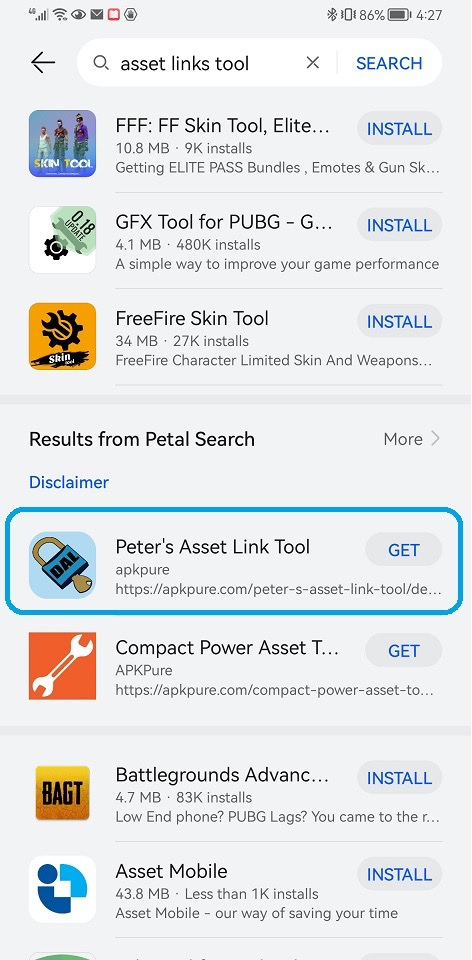
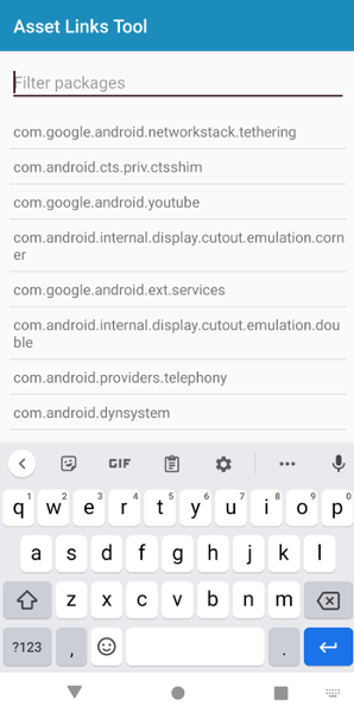
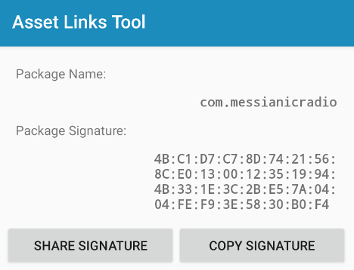

# Removing the Browser Address Bar

Last updated on 2/1/2022

If you’re seeing a browser address bar in your PWA Android app, it means you need to update your digital asset links, the `assetlinks.json` file.

This document shows how to fix this issue so the browser address bar won’t show up. If you’re not using the Huawei Browser and the browser address bar appears at the top of your Android app, it means that your asset links have not been set up correctly. If your asset links are correct, the address bar will only disappear when you are using the Chrome Browser.

**Make sure assetlinks.json is valid and accessible**

If you’re not sure what asset links are or if you don’t have an `assetlinks.json` file, go back and read our [Testing and publishing your Android PWA to Huawei AppGallery page](testing-and-publishing-your-app-to-huawei-appgallery.md).

Once you have an `assetlinks.json` file deployed to your server, make sure it’s accessible via a web browser at `https://YOUR-PWA-URL/.well-known/assetlinks.json`. (Replace YOUR-PWA-URL with your PWA’s URL.) It’s important that this file be in the `/.well-known` subdirectory as shown above. Chrome on Android will look at this URL for your asset links file and will show the browser address bar if it’s not found.

**Add production fingerprint**

If you haven’t already, you need to add your AppGallery production fingerprint to your `assetlinks.json` file. Sign in to the **Huawei AppGallery Console > select App > App Signing**, then copy your SHA-256 fingerprint (see [Configuring the New Certificate Fingerprint](https://developer.huawei.com/consumer/en/doc/development/AppGallery-connect-Guides/agc-appsigning-newapp-0000001052418290#section1959661616436)):

Paste that fingerprint into your `assetlinks.json` file:

	[
		{
			"relation": ...,
			"target": {
				"namespace": ...,
				"package_name": ...,
				"sha256_cert_fingerprints": [
					"...",
					"PASTE YOUR NEW SHA-256 FINGERPRINT HERE"
				]
			}
		}
	]

Once you follow these steps, the browser address bar should no longer appear in your app.

**Validate your assetlinks.json file**

If your address bar is still showing up after the above steps, the issue is likely due to incorrect asset links: Android thinking your asset links are different than what your `assetlinks.json` file specifies.

To fix this, we’ll check what Android believes are the asset links for your PWA, then update our `assetlinks.json` with the new value.

1.	Install your app on a Huawei device, device via Cloud Debugging, or Android emulator.
2.	Install the Asset Links Tool from the Huawei AppGallery.

	
3.	Run the Asset Links Tool and search for your PWA’s package ID (e.g. com.myawesomepwa):

	
4.	Tap your PWA’s package ID to view its asset links, then tap Copy Signature:

	
5.	Open your `assetlinks.json` file and find the sha256_cert_fingerprints array member. Paste the copied signature into the sha256_cert_fingerprints. Your `assetlinks.json` file should look something like this, with 2 fingerprints separated by a comma as shown below:

	
		[
			{
				"relation": ...,
					"target" : { 
						"namespace": ..., 
						"package_name": ...,
						"sha256_cert_fingerprints": [
							"...",
							"4B:C1:D7:C7:8D:74:21:56:8C:E0:13:00:12:35:19:94:4B:33:1E:3C:2B:E5:7A:04:04:FE:F9:3E:58:30:B0:F4"
						] 
					}
			}
		]
        
Save your `assetlinks.json` file and re-upload it to your server.

**Please note:**

Make sure your pasted fingerprints have a comma between them, otherwise your assetlinks.json will contain invalid JSON. You can [validate your JSON](https://jsonformatter.curiousconcept.com/) to be sure everything’s correct.

Once you follow these steps, the browser address bar should no longer appear in your app.
Make sure there are no redirects

Another common cause of the address bar showing is redirected across origins. (Cosmetic redirects are fine.)

For example, if your site automatically redirects to a different subdomain (e.g. `https://myawesomepwa.com` redirects to `https://www.myawesomepwa.com`), you’ll need to make sure to generate your Android package on PWABuilder with the correct, canonical URL.

For example, if you always redirect to `https://www.myawesomepwa.com` (the www subdomain), you need to generate your Android package on PWABuilder using the same URL, in this case, the one with the www subdomain.

Likewise, if you redirect the www subdomain to the bare domain, you’ll need to use the bare domain in PWABuilder when generating your Android package.

**Bottom line: whatever URL you redirect to, that’s the URL you need to put into PWABuilder**. If you don’t do this, the Android platform will look for asset links at a URL that redirects, which renders your asset links invalid and causes the address bar to appear.

[See this issue](https://github.com/GoogleChromeLabs/bubblewrap/issues/310#issuecomment-685505871) for more information.

**Clearing your site’s cache**

If you had previously installed your PWA on an Android device, your `assetlinks.json` file might be cached. Uninstall isn’t enough; you may have to manually clear the browser’s cache for your site before Chrome detects an updated assetlinks.json file.

**The browser address bar is still showing**

If you have applied all these steps and are still seeing the browser address bar, please go ahead and [open an issue here](https://github.com/pwa-builder/PWABuilder/issues/new?assignees=&labels=android-platform&body=Type%20your%20question%20here.%20Please%20include%20the%20URL%20to%20your%20app%20in%20Google%20Play.%0A%0A%3E%20If%20my%20answer%20was%20in%20the%20docs%20all%20along%2C%20I%20promise%20to%20give%20%245%20USD%20to%20charity.&title=Address%20bar%20still%20showing%20in%20my%20app) and PWABuilder team will help you out.

*The information on this page is sourced from [PWABuilder.com blog](https://blog.pwabuilder.com/docs/removing-the-browser-address-bar).*

