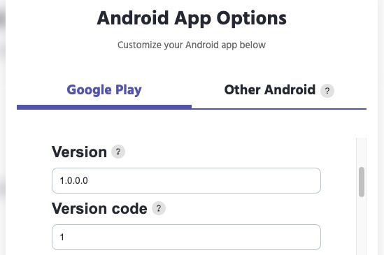
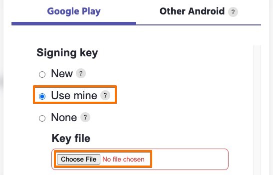
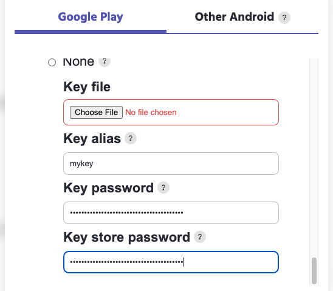
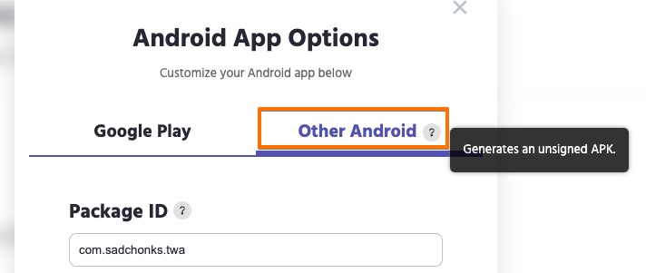

# Updating your existing app

Last updated on 2/1/2022

Updating an existing app on the Huawei AppGallery
If have an existing app in the Huawei AppGallery and you want to publish a new version of it, follow these steps:

1.	[Generate your new package](how-to-generate-pwa-android-package-for-huawei-appgallery.md).
2.	Specify your new App version and App version code:

	
3.	Scroll down to Signing key and choose **Use mine** and upload your own keystore file:

	
4.	Choose your existing signing key file, and fill in your existing signing key information (key alias, key password, store password)

	
5.	Build your package.

**Please note**

If you do not want to use PWABuilder to sign your Android package, you can use **Other Android** tab to generate the unsigned PWA APK, then manually sign it yourself using your own keystore.

 
[PWABuilder](https://www.pwabuilder.com/) will build a package signed with your existing key. When you upload it to Huawei AppGallery, it’ll automatically be recognized as a new version of your existing app.

*The information on this page is sourced from [PWABuilder.com blog](https://blog.pwabuilder.com/docs/updating-your-existing-app).*

